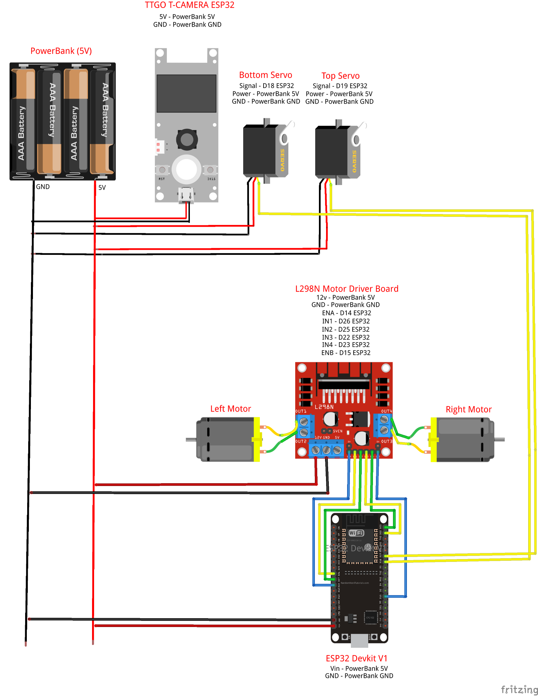

# Computação Física e Aplicações
## ACH2157
## Escola de Artes, Ciências e Humanidades
**Autores**
Juan
Ryan Alexsander Forti **126932674**
Vitor Martins Cruz **11845410**

# WebCar
> Repositório criado para a documentação do projeto WebCar, desenvolvido durante a matéria de Computação Física e Aplicações, ministrada pelo Professor Doutor Fábio Nakano na Universidade de São Paulo. 

## 1. Introdução

O WebCar é um projeto de um carrinho que pode ser controlado remotamente por meio de uma rede WiFi, sendo possível controlar a sua velocidade, direção, além de poder posicionar uma câmera (acoplada) de acordo com a vontade do usuário.

O projeto implementa um servidor web em um dispositivo ESP32, permitindo o controle de motores e servos remotamente por meio de uma interface web interativa. O servidor web utiliza a biblioteca ESPAsyncWebServer para fornecer uma interface e a biblioteca ESPAsyncWebSocket para comunicação bidirecional em tempo real com a página web.

## 2. Funcionalidades
O WebCar é controlado por meio de uma página web. Com isso, o usuário pode ter acesso as seguintes funcionalidades:
- Controle velocidade do carrinho;
- Alteração da direção do carrinho (frente, ré, esquerda e direita);
- Alteração do ângulo de visualização da câmera por meio de dois dois servos (horizontal e vertical);
- Transmissão da imagem da câmera.

## 3. Configuração do ambiente
### Requisitos de hardware
| Componente               | Quantidade |
|--------------------------|------------|
| ESP32 DevKit v1          | 1          |
| TTGO T-CAMERA ESP32      | 1          |
| Servo Motor - SG90       | 2          |
| Ponte H - L298N          | 1          |
| Motor DC 3-6V            | 2          |
| Roda 68mm                | 2          |
| Roda Boba Nylon          | 1          |
| Power Bank 5V            | 1          |
| Chassi MDF               | 2          |
| Jumpers                  | 18         |

### Requisitos de software
- Possuir o projeto "clonado" em sua máquina;
- Possuir a Arduino IDE para utilização do ESP32 https://randomnerdtutorials.com/getting-started-with-esp32/

## 4. Organização e Arquitetura
### Diagrama de Arquitetura

### Componentes físicos
- **ESP32**

- **Ponte H**

- **Servos Motores**

- **TTGO T-CAMERA ESP32**

### Comunicação

## 5. Código
### Bibliotecas
São utilizadas diversas bibliotecas para suporte a funcionalidades específicas do ESP32 e para facilitar a implementação do servidor web. As bibliotecas incluídas são:

- WiFi.h: Gerencia a conexão Wi-Fi.
- AsyncTCP.h: Biblioteca para comunicação assíncrona pela rede.
- ESPAsyncWebServer.h: Implementa um servidor web assíncrono para o ESP32.
- ESP32Servo.h: Facilita o controle de servos motores no ESP32.
- iostream e sstream: Utilizadas para manipulação de strings.

~~~C
#include <WiFi.h>
#include <AsyncTCP.h>
#include <ESPAsyncWebServer.h>
#include <ESP32Servo.h>
#include <iostream>
#include <sstream>
~~~

### Constantes
Definimos diversas constantes que representam pinos, direções e valores específicos para o funcionamento do sistema. Essas constantes são utilizadas para configurar os pinos de servo motores, motores DC e direções de movimento.

~~~C
#define BOTTOM_SERVO_PIN 18
#define TOP_SERVO_PIN 19
#define UP 1
#define DOWN 2
#define LEFT 3
#define RIGHT 4
#define STOP 0
#define RIGHT_MOTOR 0
#define LEFT_MOTOR 1
#define FORWARD 1
#define BACKWARD -1
~~~

### Configuração de Rede
As credenciais do ponto de acesso (Access Point - AP) são definidas nas variáveis ssid e password. O dispositivo ESP32 é configurado para conectar como ao AP da câmera.

~~~C
const char* ssid = "LilyGo-CAM-C8:2B";
const char* password = "";
~~~

### Configuração de Servidor Web
O servidor web é configurado na porta 80 usando a instância AsyncWebServer. Além disso, é definida uma instância de AsyncWebSocket para a comunicação em tempo real com a página web.

~~~C
AsyncWebServer server(80);
AsyncWebSocket ws("/ws");
~~~

### Página Web
A interface web é definida como uma string HTML na variável index_html. Ela contém controles para movimentação do carrinho, controle do servo superior e inferior, e exibição de uma transmissão de vídeo. Os controles são atualizados utilizando WebSocket para enviar comandos para o ESP32.

~~~html
const char index_html[] PROGMEM = R"HTMLHOMEPAGE(
<!DOCTYPE html>
<html>
  <head>
    <meta name="viewport" content="width=device-width, initial-scale=1, maximum-scale=1, user-scalable=no">
    
  </head>
  <body>
    

      </td>
      

        

          

            <button onmousedown='sendData("MoveCar","1")' onmouseup='sendData("MoveCar","0")' class="cross-top"></button>
            <button onmousedown='sendData("MoveCar","2")' onmouseup='sendData("MoveCar","0")' class="cross-bottom"></button>
            <button onmousedown='sendData("MoveCar","3")' onmouseup='sendData("MoveCar","0")' class="cross-left"></button>
            <button onmousedown='sendData("MoveCar","4")' onmouseup='sendData("MoveCar","0")' class="cross-right"></button>
            <button onclick='sendData("MoveCar","0")' class="cross-circle"></button>
          

        

        

          
Servo Superior

          

            <input type="range" min="0" max="180" value="90" class="slider" id="Top" oninput='sendData("Top",value)'>
          

    
          
Servo Inferior

          

            <input type="range" min="0" max="180" value="90" class="slider" id="Bottom" oninput='sendData("Bottom",value)'>
          

    
        

      

    

    
  </body>    
</html>
)HTMLHOMEPAGE";
~~~

### Funções de Controle de Motores e Servos
**rotateMotor(int motorNumber, int motorDirection)**: Controla a direção de rotação de um motor DC, com base no número do motor e na direção desejada.

~~~C
void rotateMotor(int motorNumber, int motorDirection)
{
  if (motorDirection == FORWARD)
  {
    digitalWrite(motorPins[motorNumber].pinIN1, HIGH);
    digitalWrite(motorPins[motorNumber].pinIN2, LOW);    
  }
  else if (motorDirection == BACKWARD)
  {
    digitalWrite(motorPins[motorNumber].pinIN1, LOW);
    digitalWrite(motorPins[motorNumber].pinIN2, HIGH);     
  }
  else
  {
    digitalWrite(motorPins[motorNumber].pinIN1, LOW);
    digitalWrite(motorPins[motorNumber].pinIN2, LOW);       
  }
}
~~~

**moveCar(int inputValue)**: Controla o movimento do carro com base no valor de entrada recebido, que representa uma direção específica.
~~~C
void moveCar(int inputValue)
{
  ledcWrite(PWMSpeedChannel, 255);
  switch(inputValue)
  {
    case UP:
      rotateMotor(RIGHT_MOTOR, FORWARD);
      rotateMotor(LEFT_MOTOR, FORWARD);                  
      break;
  
    case DOWN:
      rotateMotor(RIGHT_MOTOR, BACKWARD);
      rotateMotor(LEFT_MOTOR, BACKWARD);  
      break;
  
    case LEFT:
      rotateMotor(RIGHT_MOTOR, BACKWARD);
      rotateMotor(LEFT_MOTOR, FORWARD);  
      break;
  
    case RIGHT:
      rotateMotor(RIGHT_MOTOR, FORWARD);
      rotateMotor(LEFT_MOTOR, BACKWARD); 
      break;
 
    case STOP:
      rotateMotor(RIGHT_MOTOR, STOP);
      rotateMotor(LEFT_MOTOR, STOP);
      break;
  
    default:
      rotateMotor(RIGHT_MOTOR, STOP);
      rotateMotor(LEFT_MOTOR, STOP);    
      break;
  }
}
~~~

**webSocketEventHandler(...)**: Lida com eventos WebSocket, interpretando os dados recebidos e realizando ações correspondentes, como mover o carro ou ajustar os servos.
~~~C
void webSocketEventHandler(AsyncWebSocket *server, 
                      AsyncWebSocketClient *client, 
                      AwsEventType type,
                      void *arg, 
                      uint8_t *data, 
                      size_t len) 
{                      
  switch (type) 
  {
    case WS_EVT_CONNECT:
      Serial.printf("WebSocket client #%u connected from %s\n", client->id(), client->remoteIP().toString().c_str());
      break;
    case WS_EVT_DISCONNECT:
      Serial.printf("WebSocket client #%u disconnected\n", client->id());

      moveCar(0);
      bottomServo.write(90);
      topServo.write(90);       
      break;
    case WS_EVT_DATA:
      AwsFrameInfo *info;
      info = (AwsFrameInfo*)arg;
      if (info->final && info->index == 0 && info->len == len && info->opcode == WS_TEXT) 
      {
        std::string myData = "";
        myData.assign((char *)data, len);
        std::istringstream ss(myData);
        std::string key, value;
        std::getline(ss, key, ',');
        std::getline(ss, value, ',');
        Serial.printf("Key [%s] Value[%s]\n", key.c_str(), value.c_str()); 
        int valueInt = atoi(value.c_str());     
        if (key == "MoveCar")
        {
          moveCar(valueInt);        
        }
        else if (key == "Bottom")
        {
          bottomServo.write(valueInt);
        }
        else if (key == "Top")
        {
          topServo.write(valueInt);   
        }             
      }
      break;
    case WS_EVT_PONG:
    case WS_EVT_ERROR:
      break;
    default:
      break;  
  }
}
~~~

**setupPins()**: Configura os pinos necessários para os servos e motores DC.
~~~C
void setupPins()
{
  Serial.println("Setup pins...");

  bottomServo.attach(BOTTOM_SERVO_PIN);
  topServo.attach(TOP_SERVO_PIN);

  ledcSetup(PWMSpeedChannel, PWMFreq, PWMResolution);
      
  for (int i = 0; i < motorPins.size(); i++)
  {
    pinMode(motorPins[i].pinEn, OUTPUT);
    Serial.printf("Setting pin %d as output\n", motorPins[i].pinEn);
    pinMode(motorPins[i].pinIN1, OUTPUT);
    Serial.printf("Setting pin %d as output\n", motorPins[i].pinIN1);
    pinMode(motorPins[i].pinIN2, OUTPUT);
    Serial.printf("Setting pin %d as output\n", motorPins[i].pinIN2);
   
    Serial.printf("Attaching pin %d to channel %d\n", motorPins[i].pinEn, PWMSpeedChannel);
    ledcAttachPin(motorPins[i].pinEn, PWMSpeedChannel);
  }

  moveCar(STOP);
}
~~~

### Configuração Inicial e Loop
**setup()**: Inicializa a comunicação serial, configura os pinos, estabelece a conexão Wi-Fi com o AP (câmera), e configura o servidor web. Também define rotinas para lidar com solicitações na raiz ("/") e eventos WebSocket.

~~~C
void setup(){
  // Serial port for debugging purposes
  Serial.begin(115200);

  setupPins();

  Serial.print("Connecting to ");
  Serial.println(ssid);
  
  // Connect to Wi-Fi
  WiFi.begin(ssid, password);
  
  while (WiFi.status() != WL_CONNECTED) {
    delay(1000);
    Serial.print(".");
  }
  
  Serial.println("");
  Serial.println("Connected..!");
  Serial.print("Got IP: ");  Serial.println(WiFi.localIP());

  ws.onEvent(webSocketEventHandler);
  server.addHandler(&ws);

  server.on("/", HTTP_GET, {
    request->send_P(200, "text/html", index_html);
  });

  server.begin();
}
~~~

**loop()**: Realiza a limpeza de clientes WebSocket no loop principal.
~~~C
void loop() {
  ws.cleanupClients();
}
~~~

### Observações
- Temos constantes PWM para controlar a velocidade dos motores DC.
- Os comandos enviados pela interface web são interpretados pelo servidor e resultam em ações físicas, como movimento do carro ou ajuste dos servos.

## Considerações finais
### Dificuldades encontradas
O grupo encontrou algumas dificuldades durante o desenvolvimento do projeto. Em um primeiro momento, a intenção do grupo era utilizar apenas o compenente ESP32CAM realizando o papel de subir uma rede WiFi, sendo um AP (*access point*), uma pagína web para receber os comandos do usuário e compartilhar a imagem capturada, além de gerenciar os outros componentes físicos. Porém o grupo não conseguiu fazer os ajustes do ESP32CAM, conseguindo seguir com o projeto apenas com a troca do componente para uma TTGO T-CAMERA ESP32.

Apesar de solucionar um problema, gerou outro, a nova câmera não possui conexões suficientes para gerenciar os demais componentes físicos. Com isso, foi necessário adicionar um ESP32, este conecta na rede estabelecida pela câmera e realiza o gerenciamento da página web e componentes físicos.

O que leva ao terceiro ponto de dificuldade do grupo, pois aumentando a quantidade de componentes, aumenta a quantidade de energia necessária, aparentemente o powerbank não está conseguindo fornecer energia suficiente, levando a uma perca de conexão dos componentes e o usuário perdendo a conexão, temporariamente, com a página web. Fizemos um teste fornecendo energia de uma fonte separada (Notebook, via cabo USB) para o ESP32 e do powerbank para o restante dos componentes, onde não observamos esse comportamento de falha, tendo funcionamento íntegro do projeto. 

## Referências
- Configuração do ambiente de desenvolvimento: https://randomnerdtutorials.com/getting-started-with-esp32/
- Servo motor: https://esp32io.com/tutorials/esp32-servo-motor
- Criação da comunicação websocket: https://lastminuteengineers.com/esp32-websocket-tutorial/#uploading-the-code
